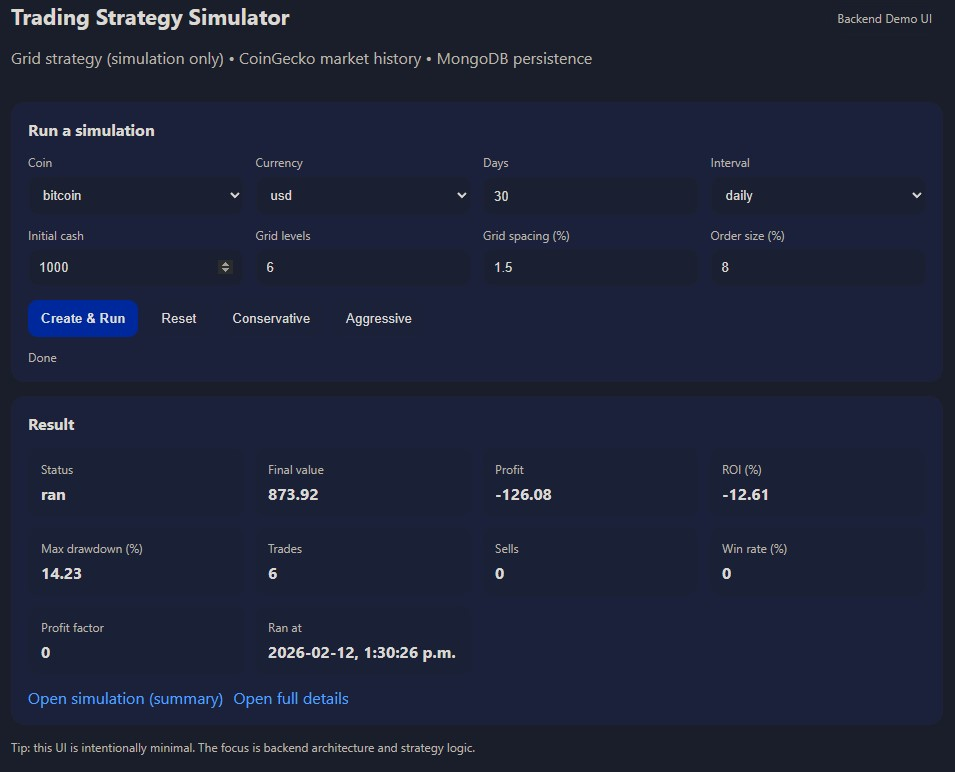

# trading-sim-api-node

A backend API for simulating algorithmic trading strategies (simulation only, no real trading).

Built with:
- Node.js (CommonJS)
- Express
- MongoDB
- CoinGecko API integration

---

## Purpose

This project demonstrates:

- Clean backend architecture
- Separation of concerns (routes, controllers, services, models)
- External API integration (timeout handling, error normalization, simple caching)
- Algorithmic trading logic (Grid strategy – MVP)
- Performance metrics computation (ROI, Max Drawdown, Win Rate, Profit Factor)
- Maintainable and readable JavaScript code

---

## Demo UI

This repository includes a minimal demo interface to make the API easy to test without using curl or Postman.

Once the server is running:

http://localhost:8081/


(or your configured HOST and PORT)

The demo allows you to:

- Select a cryptocurrency (e.g., bitcoin, ethereum)
- Configure grid strategy parameters
- Use quick presets (Conservative / Aggressive)
- Create and run a simulation
- View summary metrics instantly
- Open detailed results in a separate endpoint

The UI is intentionally minimal.  
The primary focus of this project is backend architecture and algorithmic logic.

---

## Screenshot



---

## Running Locally

Install dependencies:

npm install

Run in development mode:

npm run dev

Run in production mode:

npm start

---

## Environment Variables

Example configuration:

```
HOST=127.0.0.1
PORT=8081
MONGODB_URI=mongodb://127.0.0.1:27017/trading-sim
CACHE_ENABLED=true
COINGECKO_BASE_URL=https://api.coingecko.com/api/v3

COINGECKO_TIMEOUT_MS=5000
```
---

## API Endpoints

### Market Data

- `GET /marketdata/price`
- `GET /marketdata/history`

### Simulations

- `POST /simulations`
- `GET /simulations/:id`
- `POST /simulations/:id/run`
- `POST /simulations/:id/run?force=true`

---

## Performance Metrics

Each completed simulation includes:

- Final Portfolio Value
- Absolute Profit
- ROI (%)
- Max Drawdown (%)
- Win Rate (%)
- Profit Factor
- Trade Count

---

## Current Features (MVP)

- Create simulation configurations
- Run grid strategy simulations
- Persist results in MongoDB
- Retrieve simulation summaries or full details
- Fetch live and historical market data from CoinGecko
- In-memory TTL cache for market data
- Idempotent simulation execution (with optional force rerun)

---

## Not Included

- No real trading
- No exchange connectivity
- No authentication (MVP scope)
- No distributed job queue

---

## AI-Assisted Development

This project was developed using AI-assisted engineering (LLM collaboration).

All architectural decisions, system structure, validation rules, strategy logic, and performance metrics were intentionally designed and reviewed by the author.

AI was used as a productivity accelerator for:

- Rapid prototyping
- Refactoring iterations
- Generating structured boilerplate
- Exploring alternative implementations

The objective was not to outsource reasoning, but to accelerate structured backend development while maintaining full ownership of design decisions.

---

## Portfolio Context

This repository is part of a backend-focused portfolio demonstrating:

- Service-oriented architecture
- API design best practices
- Data modeling with MongoDB
- External API integration
- Algorithmic logic implementation
- Practical use of AI as an engineering tool

---

## License

For demonstration and portfolio purposes.
